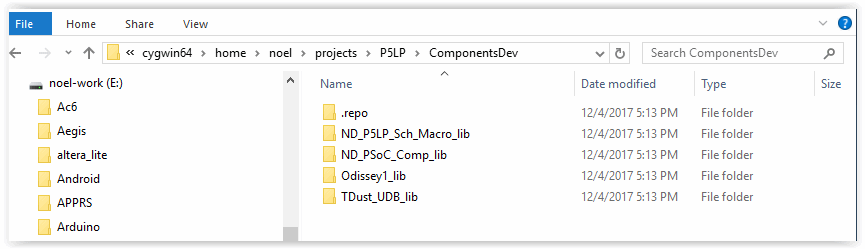
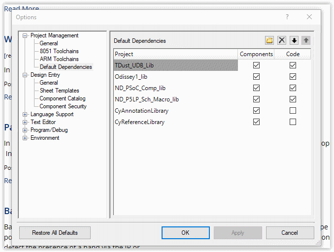
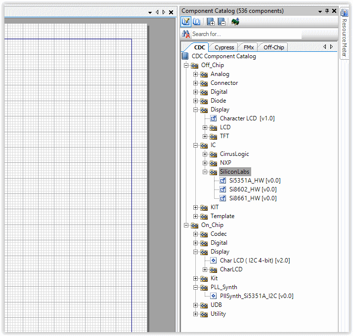

# P5LP_CompTest_repo
~~~~~~~~~~~~~

*P5LP_CompTest_repo* repository holds the default.xml manifest to allow the
use of Google's "repo" to manage a number of GitHub repositories for testing
The CDC Components of the P5LP_Comp_lib. +
If you are unfamiliar with repo, you can read up on it
https://code.google.com/archive/p/git-repo/[here].

The *P5LP Component Test Library* 
repositories catered for are as follows

TODO

# Download and Install Google's repo utility

The above libs are managed by the repo utility. First we need to create
our work environment

....
$: mkdir ~/bin
$: curl http://commondatastorage.googleapis.com/git-repo-downloads/repo > ~/bin/repo
$: chmod a+x ~/bin/repo 
....

Edit ~/.bash_profile and uncomment lines 32, 33 and 34 to add ~/bin to
PATH

# Create the P5LP directory

....
$: mkdir -p ~/projects/P5LP
$: cd projects/P5LP
....

# Initialise the repositories for PSoC_5LP Components

....
$: repo init -u https://github.com/noeldiviney/PSoC_5LP_repo
....

# Download the PSoC_5LP Component Libraries

....
$: repo sync
....

once this has completed you should have PSoC_5LP Component Libraries in
place

# Configure PSoC Creator to add the CDC Componet libraries

* Launch PSoC Creator and select "File->New->Project"
* In "Select project type" dialog select "Target Device" = "PSoC 5lp  CY8C6888LTI-LP097"
* In "Select project template" select "Empty schematic"
* In "Create Project" dialog select
** Workspace Name      =  "CompTest"
** Location            =  "Path\To\cygwin64\home\"you"\projects\P5LP" 
** Project Name        =  "CompTest"
* and "finish"

When new "CompTest" project is launched

* select Tools->Options
* In "Options" dialog select "Project Management->Default Dependencies"
* Navigate to "Path\To\cygwin64\home\"you"\projects\P5LP\Components"
* Use the "New Entry" button to find and "open" each Library's .cyprj file

When finished the "Tools->Options" dialog should look like the following image

The "Component Catalog" tree should look like the following

