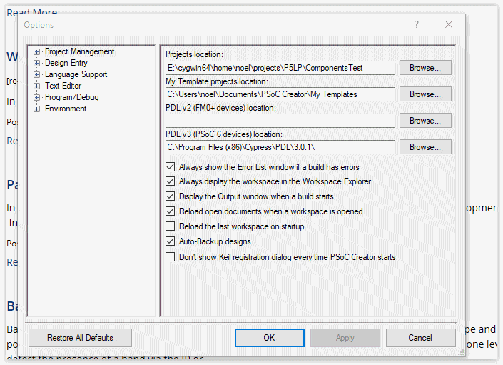

# P5LP_CompTest_repo
~~~~~~~~~~~~~

*P5LP_CompTest_repo* repository holds the default.xml manifest to allow the
use of Google's "repo" to manage a number of GitHub repositories for testing
The CDC Components of the P5LP_Comp_lib. +
If you are unfamiliar with repo, you can read up on it
https://code.google.com/archive/p/git-repo/[here].

The *P5LP Component Test Library* 
repositories catered for are as follows

https://github.com/noeldiviney/TinyPrintf_Test

https://github.com/noeldiviney/CharLCD_I2C_Test

https://github.com/noeldiviney/AudioClkGen_Test

TODO ... more Test demos

# I am using Cygwin64 for my Git/Repo working environment
## Sadly!! we have to use Windows 10 for PSoC Creator

http://www.mcclean-cooper.com/valentino/cygwin_install/[Cygwin install
howto]

I also installed apt-cyg (cygwin apt-get) and gem. +
For editing markdown and asciidoc files I istalled
https://github.com/asciidocfx/AsciidocFX/releases/download/v1.5.6/AsciidocFX_Windows.exe[AsciidocFX] +
Add other files as required

# Download and Install Google's repo utility

....
$: mkdir ~/bin
$: curl http://commondatastorage.googleapis.com/git-repo-downloads/repo > ~/bin/repo
$: chmod a+x ~/bin/repo 
....

Edit ~/.bash_profile and uncomment lines 32, 33 and 34 to add ~/bin to
PATH

# Create the PSoC_5LP Test directory

....
$: mkdir -p ~/projects/P5LP/ComponentsTest
$: cd projects/P5LP/ComponentsTest
....

# Initialise the ComponentsTest directory

....
$: repo init -u https://github.com/noeldiviney/P5LP_CompTest_repo
....

# Download the P5LP Component Test Projects

....
$: repo sync
....

once this has completed you should have P5LP Component Test Projects in
place

image::images/ComponentTests.gif[Component Tests]

# Configure PSoC Creator to add the CDC Component libraries

* Launch PSoC Creator
* select "Tools->Options"
* Setup the "Options"  dialog as per the following image

* Ensure that "Projects Location" shows ~\projects\P5LP\ComponentsTest"
* Now select "Project Management->Default Dependencies"
* Navigate to "~\projects\P5LP\ComponentsDev"
* Use the "New Entry" button to find and "open" each Libratiy's .cyprj file

## When finished the "Project Management->Default Dependencies" dialog should look like the following

image::images/DefaultDependencies.gif[Default Dependencies]

* When finished press "Ok" to close the dialog
# Create "Empty Schematic" project

* Use "File->New->Project" to launch the "Create Project" dialog
* Select "Target device"
* Select "PSoC 5LP" and "CY8C5888LTQ-LP097"   and  "next" btn
* Select "Empty Schematic" and "next" btn
* Select "Finish" btn to launch the new project
* In "Project Explorer" Window double click on the "TopDesign.cysch"
* In the "Component Catalog" window on the right select "CDC" tab

## The "Component Catalog" tree should look like

image::images/CDC_Catalog.gif[Component Catalog]

# Developing Projects in ~projects/P5LP/ComponentsTest

* I will use "CharLCD_I2C_Test" as an example

* To prepare for Git it is neccessdary to check out a branch 

....
$: git checkout master   or whatever branch one wishes to use
....
 
* Use "File->Open->Project Workspace" to launch the "Open" dialog
* Navigate to and then "open" "CharLCD_I2C_Test.cywrk"
* perform any development and Testing

## When done use "git commit -a" and "git push" to save the work
....
$: git commit -a
$: git push https://github.com/noeldiviney/CharLCD_I2C_Test.git  (in my case)
....

# TODO this is a "Work in progress"
# My intention is to document all of this more thoroughly using GitHub Wiki
